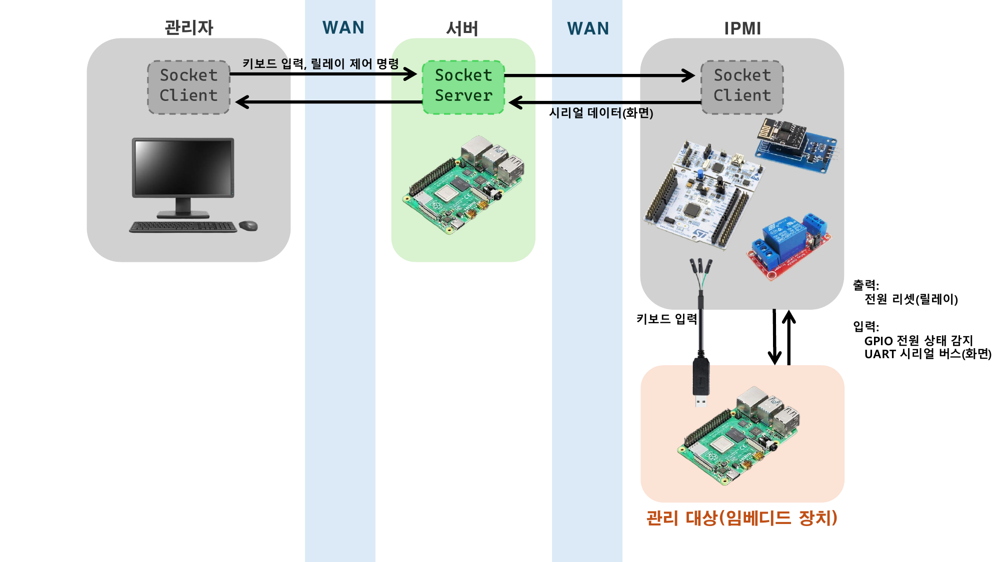

# IPMI: 원격 시리얼 콘솔 및 장치 제어 시스템 (mini-ipmi)

**시연 영상:** [https://youtu.be/-TKU3jO3g9s](https://youtu.be/-TKU3jO3g9s)

  
  

본 프로젝트는 OS 크래시나 네트워크 단절 등 소프트웨어 기반 원격 제어(SSH 등)가 불가능한 장애 상황에서 하드웨어 통로를 통해 타겟 디바이스를 원격 복구 및 제어하기 위한 독립형 하드웨어 관리 솔루션입니다.

STM32를 중앙 제어 장치로 활용하여 원격 관리자 클라이언트(Linux TCP Socket)와 타겟 디바이스 간 양방향 통신, 하드웨어 전원 제어 및 커널 패닉 복구 기능을 제공합니다.

## 1. 시스템 아키텍처

- 관리자(Admin) Client: TCP Socket 또는 Bluetooth(로컬) 기반 원격 제어 명령 전송.
- STM32 (KVM/IPMI Controller): 관리자의 명령 수신(ESP8266 Wi-Fi) 및 타겟 디바이스의 릴레이 전원 제어, USB HID(Keyboard) 입력 주입, 시리얼 로그(UART) 중계 수행.
- 타겟 디바이스: 현재 Raspberry Pi 4B (Linux) 기반으로 안전 종료(Graceful Shutdown) 및 복구 모드 진입(Recovery Boot) 통제 기능을 검증함.

## 2. KVM 구현 범위 및 디바이스 확장성

현재 시스템의 KVM 기능 중 마우스 제어는 구현되어 있지 않으며, 키보드 제어(USB HID)만을 지원합니다. 
초기 개발 및 검증 타겟은 리눅스 디바이스(Raspberry Pi 4B)를 기준으로 진행하였으나, 향후 일반 데스크톱 PC 및 서버 지원을 목표로 USB HID 키보드 입력 주입 기능을 구현하였습니다. 이는 데스크톱 마더보드에서 지원하는 BIOS 화면 시리얼 출력(Console Redirection) 기능과 연동하여, 네트워크가 차단된 일반 PC 대상의 원격 제어 시스템으로 확장 가능합니다.

## 3. 디렉터리 구조

프로젝트는 모듈별로 분리되어 있으며, 각 디렉터리 내의 README.md에서 상세 내용을 확인할 수 있습니다.

- linux_socket_app/: 관리자용 CLI 툴 및 타겟 장비용 데몬(C TCP Socket).
- stm32_firmware/: 하드웨어 직접 제어, Wi-Fi 통신, FreeRTOS 기반 디커플링 및 릴레이 제어 로직.
- docs/: 시스템 아키텍처 설계서 및 트러블슈팅 리포트.
- rpi4b_boot_config/: 타겟 디바이스(Raspberry Pi) 커널 파라미터 분기 및 디바이스 트리 오버레이 설정 텍스트 파일.
